# Jarrab — Quiz App (Flutter) • Offline‑first (SQLite) + Firebase

Application mobile de quiz construite en **Flutter** avec une architecture **feature‑first** et une gestion d’état **UDF via BLoC (flutter_bloc)**.  
L’app est pensée **offline‑first** : le catalogue est **seedé depuis Firestore** puis **mis en cache dans SQLite**, et les résultats sont d’abord écrits **localement** avant d’être **synchronisés** vers Firestore.

---

## 🎯 Objectif (TP3 Flutter + Firebase)

Ce projet a été réalisé dans le cadre du **TP3** afin de se familiariser avec :
- **Firebase Auth** (connexion / anonymat)
- **Cloud Firestore** (catalogue, profils, stats, attempts, leaderboards)
- **Offline cache SQLite** (+ stratégie de synchronisation)
- **Routing** avec `go_router`
- **Internationalisation (i18n)** via ARB


---

## ✨ Fonctionnalités

### Auth / Session
- Page **Login / Sign up** (UI prête + intégration Auth selon configuration)
- Mode **anonyme** possible (l’utilisateur peut jouer sans créer de compte)
- Gestion des permissions : certaines vues (ex: leaderboard complet) peuvent être restreintes si l’utilisateur est anonyme

### Home
- Affichage des **quizzes “featured”** et **catégories**
- Recherche (UI)
- Chargement via **cache SQLite**, refresh possible

### Quiz
- Session de quiz avec :
  - timer par question
  - sélection d’une réponse + progression
  - calcul score / points

### Results
- Écran de résultat : score + résumé correct/incorrect + retry + share

### Profil
- Profil (UI) + stats (quizzes taken, accuracy, streak, niveau/xp si activé côté data)

### Leaderboard
- Classement **All‑time** et **Weekly** (selon données sync/caches)

### Settings
- Langue / thème (UI + i18n prête)
- Toggles (notifications, sound effects, haptics) côté UI

---

## 🧱 Stack technique

- **Flutter** + Material 3
- **State management** : `flutter_bloc` (UDF)
- **Routing** : `go_router`
- **Firebase** : Auth + Firestore *(Storage/Analytics optionnels)*
- **Offline cache** : `sqflite`
- **Préférences** : `shared_preferences`
- **i18n** : ARB (`lib/l10n`)

---

## 🗂️ Architecture (feature‑first)

```
lib/
  core/
    constant/  di/  error/  routing/  ui/  utils/
  features/
    splash/
    auth/
    home/
    quiz/
    leaderboard/
    profile/
    settings/
  l10n/
  firebase_options.dart
  main.dart
  app.dart
```

### Répartition par couche (à l’intérieur de chaque feature)
- `data/` : models, mappers, repositories impl, services (Firebase/SQLite)
- `domain/` : entities, repositories (abstractions), usecases
- `presentation/` : pages, widgets, bloc

---

## 🔥 Schéma Firestore (référence)

### Collections principales
- `categories/{categoryId}`
- `quizzes/{quizId}` *(questions inline dans le document)*
- `users/{uid}`
  - `users/{uid}/attempts/{attemptId}`
  - `users/{uid}/stats/main`
  - `users/{uid}/achievements/{achievementId}`
- `leaderboards_all_time/global/entries/{uid}`
- `leaderboards_weekly/{weekKey}/entries/{uid}`

> Le fichier `import-fixed.json` décrit la structure attendue (seed + exemples).  
> Pour les quizzes, les questions sont stockées sous forme de map `questions: { q1: {...}, q2: {...} }`.

---

## 🔄 Synchronisation & Offline‑first

### 1) Sync catalogue (Firestore → SQLite)
- Au démarrage (Splash), l’app initialise la base SQLite et récupère le **catalogue** (categories + quizzes).
- L’UI lit **SQLite en priorité** pour un affichage instantané, puis se met à jour si Firestore a des données plus récentes.

### 2) “Outbox” user data (SQLite → Firestore)
- À la fin d’un quiz, l’app enregistre d’abord :
  - `attempt` (tentative)
  - `stats` (progression)
  - `leaderboards` locaux
- Ensuite, une sync pousse vers Firestore (si connecté) :
  - `users/{uid}/attempts/{attemptId}`
  - `users/{uid}/stats/main`
  - `leaderboards_all_time/global/entries/{uid}`
  - `leaderboards_weekly/{weekKey}/entries/{uid}`

---

## ✅ Pré‑requis

- Flutter SDK (stable)
- Android Studio (ou VS Code) + émulateur / device
- Un projet Firebase (Auth + Firestore activés)

---

## ⚙️ Installation & Lancement

### 1) Dépendances
```bash
flutter pub get
```

### 2) Configuration Firebase
1. Créer un projet sur Firebase Console
2. Ajouter l’app Android (et iOS si besoin)
3. Télécharger `google-services.json` → `android/app/`
4. Activer :
  - **Firebase Auth** (Email/Password et/ou Anonymous selon votre choix)
  - **Cloud Firestore**

**Recommandé (FlutterFire)**
```bash
dart pub global activate flutterfire_cli
flutterfire configure
```

> Cela génère `lib/firebase_options.dart`.

### 3) Lancer l’app
```bash
flutter run
```

---
---

## 🖼️ Captures 
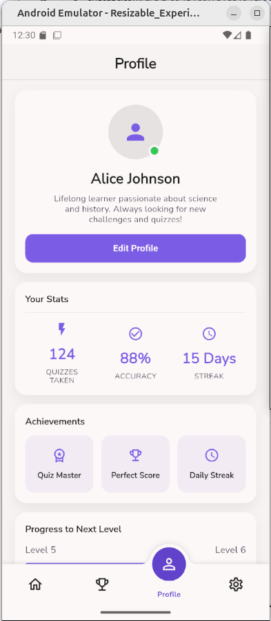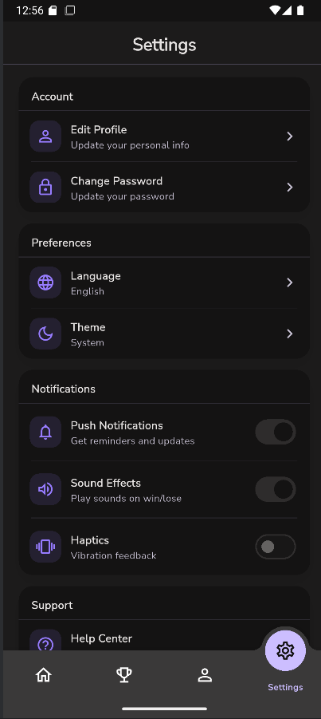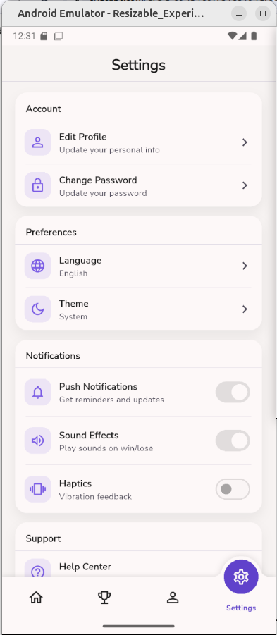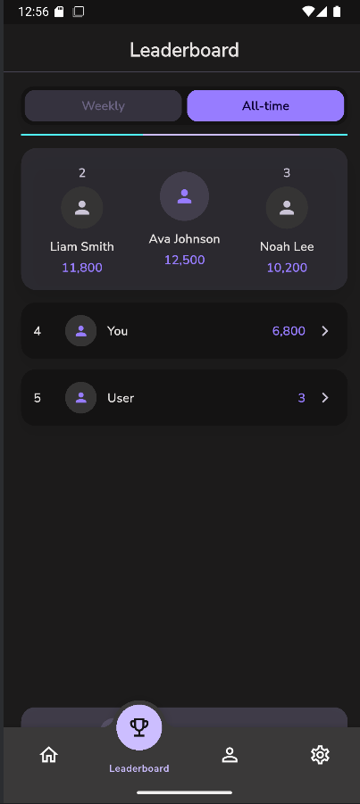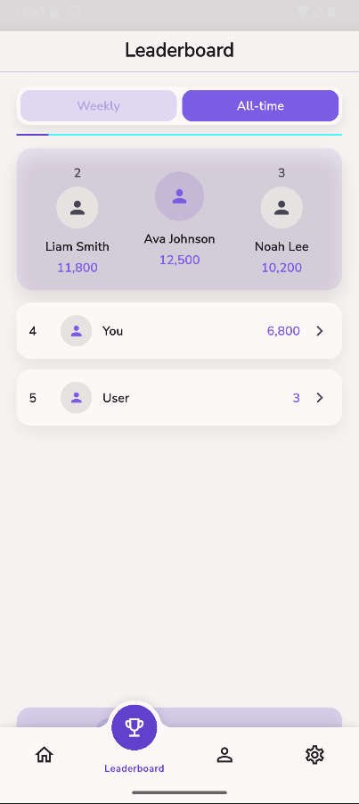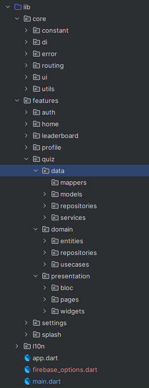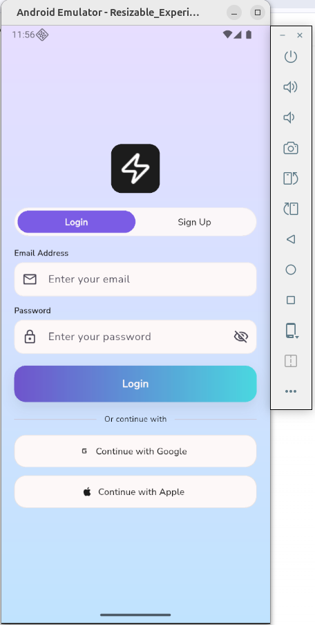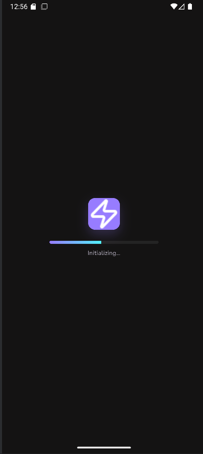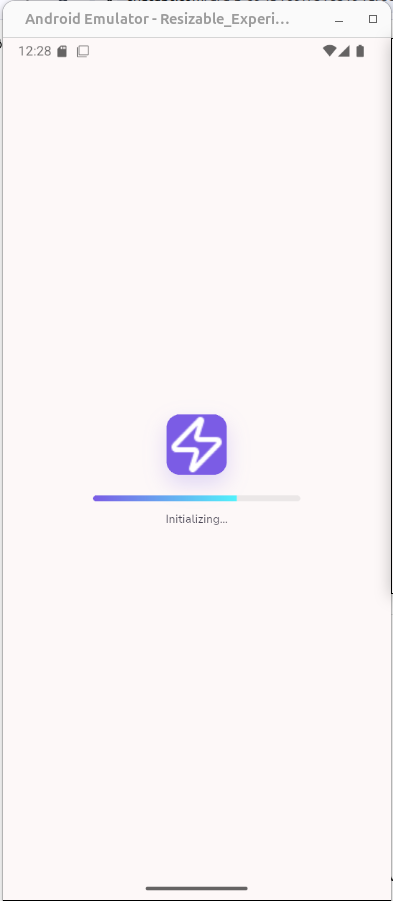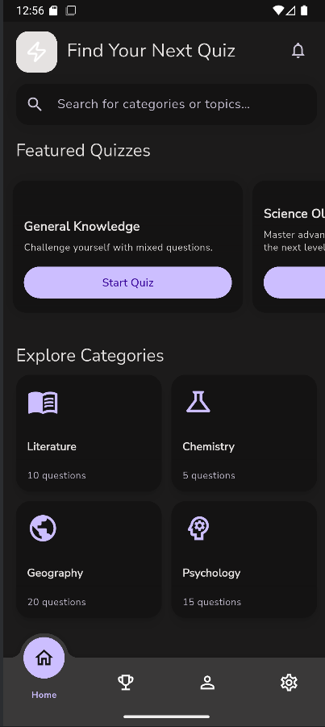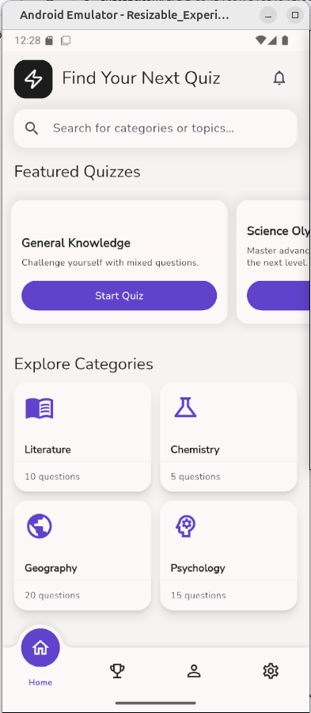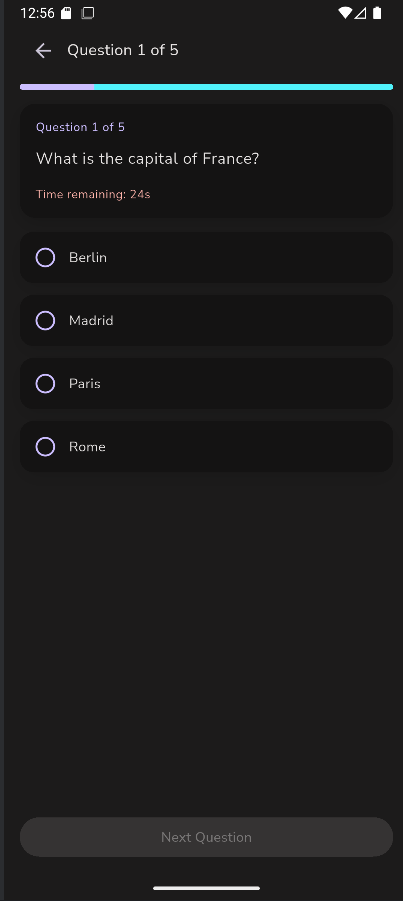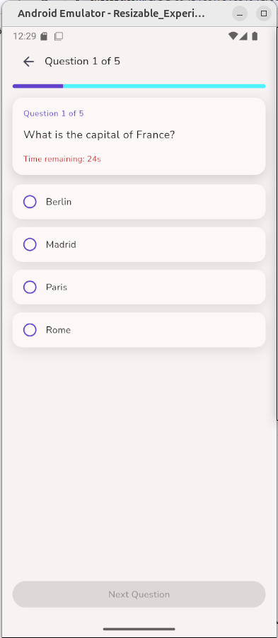
---

## 👤 Auteur
- Ahmedou SALEM

---